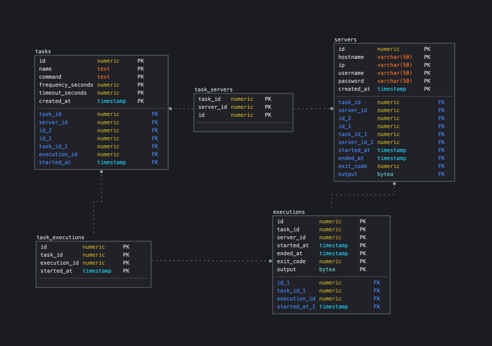

# remote-cron-api

A service that executes scheduled tasks across many servers and collects the output of those tasks after the executions are completed.

Capabilities:
* A user can create a scheduled, periodic task.
* A user can retrieve the output of the latest complete task execution.
* A user can view any errors encountered during the execution of a task.


# How to run locally

1. Spin up the api and postgres db using docker-compose
```
$ docker-compose up
```

2. Server will start up at port 3000

3. Create a Server Entry

```
POST http://localhost:3000/v1/api/servers
{
  "hostname": "machine1",
  "ip": "127.0.0.1",
  "username": "root",
  "password": "pwd"
}
```

3. Create a Task Entry with that server
```
POST http://localhost:3000/v1/api/tasks
{
  "name": "task1",
  "command": "echo \"task1\"",
  "interval_seconds": 10,
  "timeout_seconds": 9,
  "servers": [1]
}
```
NOTE: If you have multiple servers created, you can pass the array of server IDs to execute

4. View Latest Task Executions
```
GET http://localhost:3000/v1/api/tasks/1/executions

```


## API Endpoints
### Tasks
```
  GET /tasks
  GET /tasks/{id}
  GET /tasks/{id}/executions
  POST /tasks
  PUT /tasks/{id}
  DELETE /tasks/{id}
```

### Servers
```
  GET /servers
  GET /servers/{id}
  POST /servers
  PUT /servers/{id}
  DELETE /servers/{id}
```

# Data structure
## SQL DB Schema


## Task Data Structure
```
{
  "id": 123,
  "name": "task1",
  "command": "echo \"most excellent!\"",
  "frequency_seconds": 5,
  "timeout_seconds": 60,
  "servers": [
    765,
    429
  ]
  "task_executions": [
    890,
    543
  ],
  "created_at": "2021-09-25 23:00:00 +0000 UTC m=+0.000000000",
}
```

## Task Executions Data Structure
```
{
  "id": 890,
  "task_id": 123,
  "started_at": "2021-09-25 23:00:00 +0000 UTC m=+0.000000000",
  "executions": [
    345,
    543
  ]
}
```

## Executions Data Structure
```
{
  "id": 345,
  "server_id": 765,
  "started_at": "2021-09-25 23:00:00 +0000 UTC m=+0.000000000",
  "ended_at": "2021-09-25 23:00:00 +0000 UTC m=+0.000000000",
  "exit_code": 1,
  "output": "<stdout/stderr>"
}
```

## Servers Data Structure
```
{
  "id": 765,
  "hostname": "server1",
  "ip": "127.0.0.1",
  "uname": "root",
  "password": "",
  "created_at": "2021-09-25 23:00:00 +0000 UTC m=+0.000000000",
}
```
